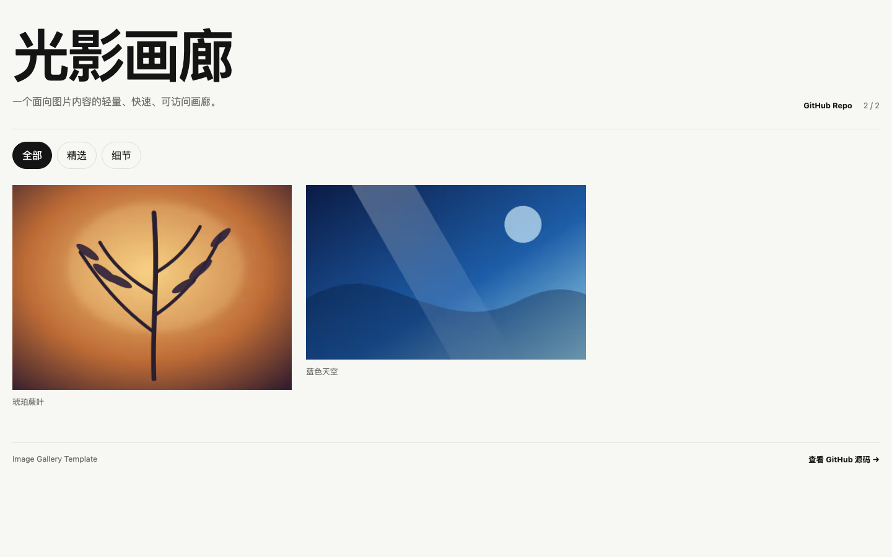

# Image Gallery Template

一个「图片优先、静态优先、AI 可协作」的图片网站模板。你只需要准备图片和内容配置，脚本会自动生成响应式的 AVIF/WebP/JPEG 图片、画廊页面和部署产物。



在线示例：

- [Cloudflare 站点](https://image-gallery-template.xiaosang.cc/)
- [GitHub Pages 站点](https://holynova.github.io/image-gallery-template/)
- [项目仓库](https://github.com/holynova/image-gallery-template)
- [单独的功能与用法说明](https://image-gallery-template.xiaosang.cc/guide.html)


## 这套模板解决什么问题？

它把「准备图片 → 写图片信息 → 压缩和生成多尺寸图片 → 检查 → 构建 → 发布」固定成一条可重复执行的流程，适合摄影集、旅行记录、作品集、产品图库、展览页面等场景。

内置能力包括：

- Sharp 图片处理：自动生成 AVIF、WebP、JPEG 响应式版本。
- 图片懒加载、首屏优先加载、批量渲染、筛选、灯箱、键盘和触摸导航。
- `alt`、栏目、尺寸、哈希、派生文件完整性校验。
- 可选 Umami 访问统计和图片打开、下载、分享事件。
- GitHub Pages 工作流和 Cloudflare Workers Static Assets 部署配置。
- 原图只留在 `incoming/`，不会被复制到线上 `dist/`。

## 1. 准备环境

需要：

- Node.js `20.3` 或更高版本
- npm
- Git（只有需要推送到 GitHub 时才需要）

克隆项目并安装依赖：

```bash
git clone https://github.com/holynova/image-gallery-template.git my-gallery
cd my-gallery
npm ci
```

如果你是从压缩包开始，而不是从 Git 克隆，也可以直接在项目目录执行 `npm install`。

## 2. 放入自己的图片

把原图放到 `incoming/` 下，可以按栏目建立子目录。例如：

```text
incoming/
  travel/
    mountain.jpg
    lake.png
  portraits/
    person.webp
```

支持 AVIF、GIF、JPEG、PNG、SVG、TIFF 和 WebP。原图可以很大，脚本会负责压缩；不要把原图放到 `public/`，也不要手动复制到 `dist/`。

## 3. 写内容配置

模板只需要维护三个 YAML 文件：

### `content/site.yml`：站点和图片处理参数

```yaml
title: "我的摄影集"
description: "记录山川、城市和日常光影。"
language: "zh-CN"
features:
  download: true
  share: true
layout:
  mode: "grid"
  batchSize: 24
  thumbWidths: [480, 768]
  detailWidths: [960, 1440, 1920, 2560]
  quality:
    avif: 55
    webp: 78
    jpeg: 84
analytics:
  enabled: true
  provider: "umami"
```

`thumbWidths` 控制列表缩略图，`detailWidths` 控制灯箱大图，数值越多会生成越多文件。`download` 和 `share` 可以改成 `false` 关闭对应功能。

### `content/collections.yml`：栏目

每个 `id` 必须唯一，建议使用小写英文和短横线：

```yaml
collections:
  - id: "travel"
    title: "旅行"
    description: "山川和城市记录。"
    order: 0
```

### `content/images.yml`：图片元数据

`source` 必须准确对应 `incoming/` 内的相对路径，`collection` 必须对应栏目 `id`，`alt` 不能为空：

```yaml
images:
  - source: "travel/mountain.jpg"
    collection: "travel"
    alt: "清晨云雾中的山脊"
    caption: "清晨山脊"
```

请只写你确实知道的信息，不要在 `alt` 或 caption 中猜测人物身份、地点或版权信息。

## 4. 生成和检查图片

按下面顺序执行：

```bash
npm run ingest    # 处理原图，生成 public/media 和 src/data/manifest.json
npm run validate  # 检查配置、图片引用和所有派生文件
npm run check     # Astro 类型和模板检查
npm test          # 运行自动化测试
npm run build     # 完整构建，最终产物写入 dist/
```

`npm run images` 是 `npm run ingest` 的别名。`public/media/` 和 `src/data/*.json` 都是生成物，不要手工编辑；如果修改了图片、YAML、宽度或质量参数，重新执行 `npm run ingest` 即可。

## 5. 本地预览

开发时使用：

```bash
npm run dev
```

然后打开终端提示的地址，通常是 `http://localhost:4321/`。构建后想预览真正的静态产物，可以使用：

```bash
npm run preview
```

重点检查：首屏图片是否出现、栏目筛选、点击图片打开灯箱、键盘左右键和 `Esc`、手机宽度布局、下载/分享按钮，以及浏览器控制台是否有 404。

## 6. 配置 Umami（可选）

图片处理和网站运行不依赖 Umami。只有在以下变量完整时，主站才会注入统计脚本：

```bash
cp .env.example .env
```

然后在 `.env` 中填写：

```bash
PUBLIC_UMAMI_SCRIPT_URL=https://cloud.umami.is/script.js
PUBLIC_UMAMI_WEBSITE_ID=你的 Umami 网站 ID
PUBLIC_UMAMI_DOMAINS=你的域名,www.你的域名
```

不要把 Umami 的管理 token、数据库密码或其他 secret 写进仓库。GitHub Pages 工作流中的同名变量也要替换成你自己的公开网站 ID。模板只发送必要事件：画廊浏览、栏目切换、图片打开、下载和分享。

## 7. 发布到 GitHub Pages

模板已经包含 `.github/workflows/deploy-pages.yml`，它会在 `master` 分支有新提交时构建并发布。

1. 在 GitHub 创建一个空仓库。
2. 修改 `package.json` 中的 `repository` 和 `homepage`，换成你的仓库地址。
3. 如果使用项目 Pages，确认工作流仍然部署到 `master`。
4. 推送代码：

```bash
git init
git branch -M master
git add .
git commit -m "build my image gallery"
git remote add origin https://github.com/<用户名>/<仓库名>.git
git push -u origin master
```

5. 在 GitHub 仓库的 **Settings → Pages** 中选择 **GitHub Actions**。
6. 打开 **Actions**，等待 `Deploy to GitHub Pages` 完成。

默认访问地址是 `https://<用户名>.github.io/<仓库名>/`。工作流会自动设置项目路径，因此不需要手动改图片 URL。

## 8. 发布到 Cloudflare

当前模板使用 Cloudflare Workers Static Assets 托管 `dist/`：

```bash
npx wrangler login
npm run deploy:cloudflare
```

发布前请编辑 `wrangler.toml` 的 `name`，并把 `package.json` 中 `deploy:cloudflare` 命令里的 `--domains=...` 改成自己的域名。域名必须已经在你的 Cloudflare 账号中；也可以先不绑定自定义域名，使用 Wrangler 返回的 `workers.dev` 地址验证。

## 9. 需要 AI 吗？

不需要。这个项目的核心流程是普通的 Node.js、Sharp、Astro 和 YAML 配置，完全可以人工完成：放图片、写三个配置文件、执行 npm 命令，然后发布。构建过程不会调用 AI API，也不需要 AI key。

AI 是一个可选的协作层，适合减少重复工作：

- 根据图片和主题起草标题、描述、栏目和 `alt` 文案。
- 批量生成 `content/images.yml`，并检查路径和栏目是否匹配。
- 帮你修改视觉文案、筛选逻辑或站点配置。
- 按本 README 执行检查、修复构建错误，并在你明确授权后协助发布。

仓库还包含 Codex 可读取的 `.agents/skills/build-gallery/` 指引，但它不是网站运行时依赖；普通用户不安装 AI 也可以正常使用。

可以把下面这段话发给 AI，并同时提供这个仓库和图片目录：

```text
请基于 image-gallery-template 创建一个图片网站。
主题：四季山野
图片目录：incoming/seasonal/
要求：创建 3 个栏目；为每张图片写准确的中文 alt 和 caption；保留原图版权信息；运行 ingest、validate、check、test、build；修复所有错误后告诉我本地预览地址。不要手工编辑生成的 manifest 和 media 文件，也不要在没有确认的情况下 push 或部署。
```

无论是否使用 AI，都应由你确认图片版权、内容描述、域名、统计账号和最终发布权限。

## 项目结构

```text
incoming/                 # 原图，只读输入
content/                  # 站点、栏目、图片元数据
scripts/                  # ingest、validate 等处理脚本
public/media/             # 自动生成的响应式图片
src/data/                 # 自动生成的 manifest 和配置 JSON
src/pages/                # Astro 页面
.github/workflows/        # GitHub Pages 发布工作流
dist/                     # 最终静态产物，不提交 Git
```

## 常见问题

**为什么页面没有图片？** 检查 `content/images.yml` 的 `source` 是否和 `incoming/` 的路径完全一致，然后重新执行 `npm run ingest` 和 `npm run validate`。

**为什么没有统计？** 检查 `.env` 或 GitHub Actions 中的 `PUBLIC_UMAMI_SCRIPT_URL`、`PUBLIC_UMAMI_WEBSITE_ID` 是否都存在，并重新构建。

**为什么不要直接改 `src/data/manifest.json`？** 它是由原图和 YAML 配置确定性生成的，手工修改下一次 ingest 就会被覆盖，也可能导致校验不一致。

**能不能只用 GitHub Pages？** 可以。Cloudflare 是可选的第二种托管方式，两者不会因为本地构建而自动同时发布。

## License

MIT
